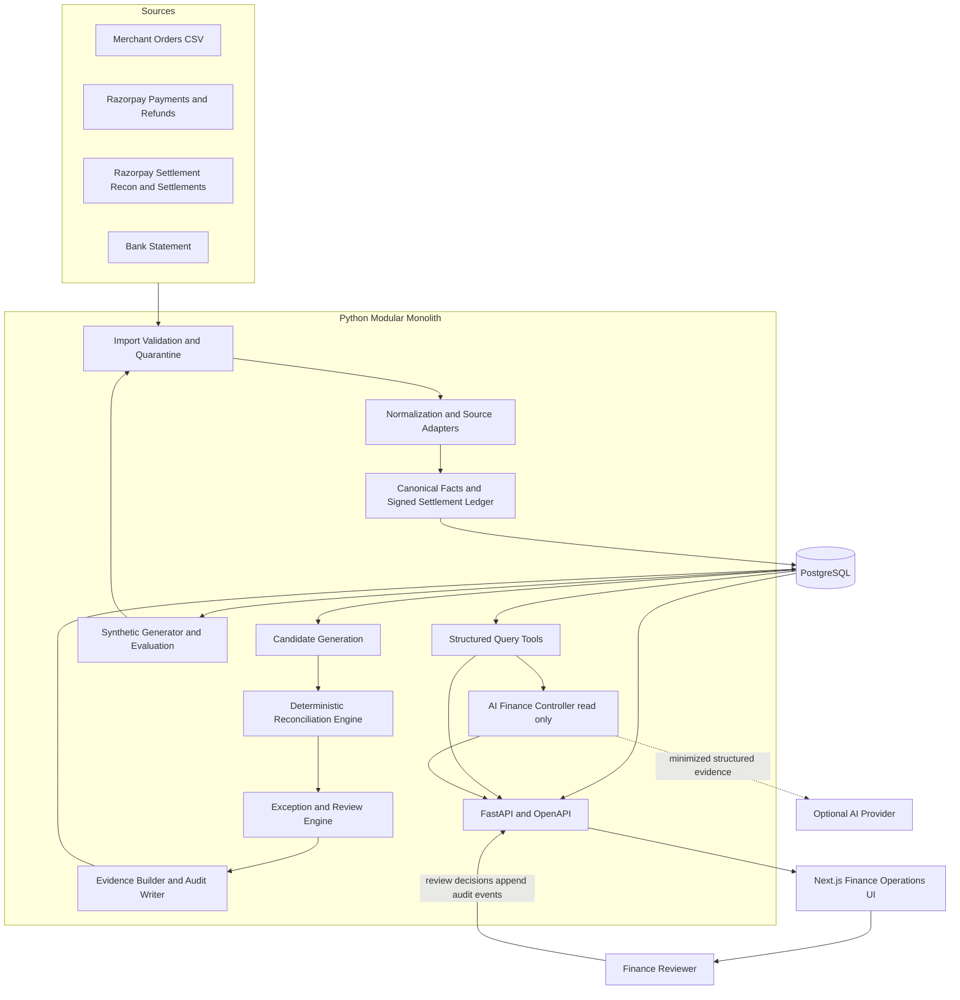
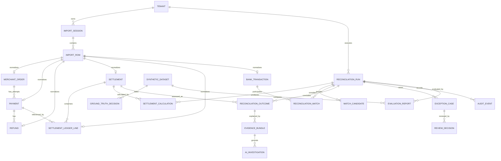
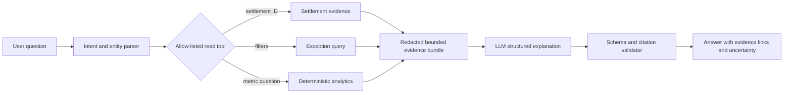

# Settlement Reconciliation Agent — Architecture Proposal

Status: Proposed for owner review  
Date: 2026-08-25  
Decision gate: No implementation until explicitly approved

## 1. Product interpretation

The product is an evidence system for one question: **can every merchant settlement received in the bank be explained by its underlying commercial and gateway activity?** It connects two related but distinct trails:

1. Commercial trail: merchant order → Razorpay order/payment attempts → captured payment/refund state.
2. Funds trail: Razorpay settlement reconciliation ledger lines → settlement batch → merchant bank credit.

The deterministic engine owns facts, arithmetic, matching, classifications, and confidence. The AI controller is a read-only investigation and explanation layer over structured findings. This separation is a product feature: a finance user can inspect the exact records and rules behind every conclusion.

### Critical correction to the original sketch

The canonical settlement calculation should use the Razorpay Settlement Reconciliation feed's transaction lines, not rebuild a batch only from payment and refund API entities. Razorpay documents transaction types including `payment`, `refund`, `transfer`, and `adjustment`, with `credit`, `debit`, `fee`, `tax`, `settlement_id`, and timestamps. This ledger captures deductions and later-settled refunds more faithfully than naïvely grouping by a `settlement_id` imagined on every payment/refund entity.

Orders, payment entities, and refund entities remain essential for completeness checks and cross-source validation. The importer retains raw fields so a fixture can prove the exact sign mapping. We must not assume settlement-level `fees` means the same thing as the sum of transaction-level payment fees; adapters and golden fixtures prevent double counting.

## 2. V1 scope and boundaries

### In scope

- Import four logical sources from CSV/JSON demo files: merchant orders, Razorpay payment/refund data, Razorpay settlement reconciliation transactions plus settlement entities, and bank statements.
- Normalize, validate, deduplicate, quarantine invalid rows, and preserve lineage.
- Reconcile orders to payment attempts, ledger lines to source entities, ledger lines to settlement batches, and settlements to bank credits.
- Calculate expected settlement from signed canonical ledger effects and compare it with the settlement entity and bank credit.
- Detect exceptions, calculate deterministic confidence, and route ambiguity to review.
- Generate reproducible synthetic datasets with private ground truth and injected anomalies.
- Evaluate decision quality and amount coverage automatically.
- Show finance overview, settlement details, exception inbox, run/evaluation report, audit evidence, and an AI query panel.
- Use an AI provider abstraction to summarize only retrieved evidence; support a deterministic/mock provider for tests and demos.

### Explicitly out of scope for V1

- Live money movement, captures, refunds, payouts, accounting journal posting, GST filing, ERP sync, chargeback management, and multi-gateway production integrations.
- Autonomous exception resolution or autonomous approval.
- Currency conversion and cross-currency settlement.
- Learned/entity-resolution models, vector search, arbitrary subset-sum matching, and agent frameworks.
- Full production webhook ingestion. Interfaces and security rules will permit it later, but file-based demonstration is the reliable hackathon path.
- Production-grade roles beyond a minimal tenant-scoped operator/reviewer model.

## 3. Requirements

### Functional

- Track imports, schemas, parser versions, raw rows, normalized records, validation issues, and duplicate decisions.
- Model multiple payment attempts per order, partial/multiple refunds, adjustments, holds, fees, tax, and delayed posting.
- Compute a settlement's expected net without floating point or double counting.
- Match references exactly where possible; generate and conservatively rank candidates when exact identifiers are absent.
- Make every result drillable to source rows, normalized facts, calculation lines, rule results, and audit events.
- Keep reconciliation runs repeatable, versioned, immutable, and comparable.
- Expose human review status without letting it rewrite deterministic evidence.
- Answer the finance questions in the brief using structured query tools.

### Non-functional

- Correctness: false automatic reconciliation is treated as more severe than a review referral.
- Reproducibility: fixed seed + generator version + scenario manifest + rule version yields the same dataset and result.
- Scale target: 10,000 normalized records and 1,000 settlements in under 30 seconds on a developer laptop; demo target is 500–2,000 orders.
- Auditability: all calculations and decisions reproducible after a run.
- Idempotency: repeated file/event import creates no duplicate normalized fact.
- Security: tenant isolation, upload validation, no secrets/PII in logs or unnecessary AI context.
- Availability: deterministic reconciliation and dashboard work when AI is unavailable.
- Accessibility: keyboard-usable, non-colour-only states, legible financial tables.

## 4. Proposed technology stack

| Area | Choice | Reason |
|---|---|---|
| Backend | Python 3.12, FastAPI, Pydantic | Typed boundaries, productive CSV/financial work, OpenAPI contract |
| Domain | Plain typed Python modules | Pure testable rules; no framework coupling |
| Persistence | PostgreSQL 16, SQLAlchemy 2, Alembic | Strong constraints, JSONB lineage, transactional runs, mature tooling |
| Frontend | Next.js, React, strict TypeScript, Tailwind | Fast finance dashboard development and good table/detail UX |
| Data processing | Python stdlib CSV initially | Dataset is small; avoid pandas/Polars until profiling justifies it |
| Testing | pytest, Hypothesis, Testcontainers or isolated PostgreSQL | Unit/scenario/property/contract coverage |
| AI | Small `AIProvider` interface with structured output; provider selected by env | No provider lock-in; deterministic application remains independent |
| Packaging | `uv` workspace or locked `pyproject.toml`; npm/pnpm lockfile | Reproducible local and CI setup |
| Deployment | Docker Compose locally; one API, one web, one PostgreSQL service | Simple hackathon operations; modular monolith |

SQLite is not the primary database because PostgreSQL constraints, JSONB, isolation, and query behavior are part of the product. Redis/Celery is deferred: one API/worker process or synchronous demo command is enough at this scale. Reconciliation is modeled as a durable run so a worker can be separated later without changing the domain.

## 5. System architecture



### Execution model

1. An import session validates a file and atomically commits accepted normalized facts plus quarantined rows.
2. A reconciliation run snapshots the included import IDs and rule/config versions.
3. Pure rule services generate candidates and calculations; the application service persists decisions and evidence transactionally.
4. Completed runs are immutable. A correction or new import creates a new run.
5. The AI layer can only call allow-listed read tools scoped to tenant and run; human review uses separate deterministic endpoints.

## 6. Target folder structure

```text
.
├── AGENTS.md
├── README.md
├── pyproject.toml
├── compose.yaml
├── .env.example
├── apps/
│   ├── api/                 # FastAPI routes, DTOs, dependency wiring
│   └── web/                 # Next.js finance UI
├── src/recon/
│   ├── domain/              # money, facts, ledger, outcomes, invariants
│   ├── ingestion/           # import sessions, validation, adapters
│   │   └── adapters/        # merchant, Razorpay, bank formats
│   ├── matching/            # normalization, candidate features, decisions
│   ├── reconciliation/      # order/payment and settlement/bank rules
│   ├── exceptions/          # taxonomy, severity, lifecycle, review
│   ├── evidence/            # evidence bundles and explanation projections
│   ├── audit/               # append-only audit service
│   ├── synthetic/           # generator, anomaly injection, ground truth
│   ├── evaluation/          # confusion matrices and amount metrics
│   ├── ai/                  # provider interface, tools, guardrails
│   └── persistence/         # SQLAlchemy repositories and unit of work
├── migrations/
├── tests/
│   ├── unit/
│   ├── scenarios/
│   ├── contracts/
│   ├── integration/
│   └── evaluation/
├── data/
│   ├── fixtures/            # small reviewed contract fixtures
│   └── generated/           # gitignored demo output and hidden truth
└── docs/
    ├── architecture.md
    ├── implementation-plan.md
    ├── data-contracts/
    └── adr/
```

## 7. Data model

All tenant-owned entities include `tenant_id`, internal UUID `id`, and UTC timestamps. External IDs are namespaced by source/account. Raw payloads live in access-controlled import rows; domain tables store typed normalized facts.

### Core entities

| Entity | Purpose and key fields | Relationships, constraints, indexes | Lifecycle |
|---|---|---|---|
| `Tenant` | Merchant/account boundary: `id`, `name`, `default_currency`, `timezone` | Unique name/slug; parent of all financial data | Created, active; deletion outside V1 |
| `ImportSession` | One source ingestion: `source_type`, filename, hash, schema/parser version, status, counts, source timezone | Unique `(tenant_id, source_type, file_hash)`; indexed status/date | RECEIVED → VALIDATING → COMPLETED/COMPLETED_WITH_ERRORS/FAILED |
| `ImportRow` | Raw lineage/quarantine: row number, payload JSON, payload hash, validation issues, disposition | Unique `(import_session_id,row_number)` and source fingerprint; restricted access | Append-only after session completion |
| `MerchantOrder` | Merchant commercial fact: external ID/reference, customer token, amount minor, currency, status, created time | Unique `(tenant_id, source_system, external_order_id)`; reference/date indexes; 1:N attempts | Upserted by newer source version; history via source facts |
| `Payment` | Razorpay payment attempt: source payment ID, Razorpay order ID, amount, currency, status, captured flag/time, method, source fee/tax, refunded amount | Unique scoped payment ID; FK/order link nullable; order/status/date indexes; 1:N refunds | State advances but imports preserve snapshots; reconciliation snapshots facts |
| `Refund` | Refund fact: source refund ID, payment ID, amount, currency, status, speed, created/processed time, bank reference if present | Unique scoped refund ID; payment/status/date indexes | pending → processed/failed; later settlement association comes from ledger line |
| `Settlement` | Gateway batch entity: source settlement ID, amount, currency, status, UTR, created/processed timestamps, source fees/tax | Unique scoped settlement ID; UTR/status/date indexes; 1:N ledger lines | created → processed/failed; source snapshots retained |
| `SettlementLedgerLine` | Canonical signed recon transaction: source entity ID, type, credit, debit, fee, tax, `net_effect_minor`, currency, on_hold, settled, source timestamps, description token, settlement ID, payment ID | Unique by source/account/entity+settlement+payload semantics; amount/currency checks; indexes on settlement/payment/type/date | Immutable normalized source fact; corrected source creates superseding version |
| `BankTransaction` | Bank statement fact: external transaction ID, booked/value times, direction, amount, currency, UTR/reference, masked description, balance | Source ID or stable fingerprint unique; UTR/date/amount composite indexes | Immutable imported fact; duplicates quarantined/flagged |
| `ReconciliationRun` | Immutable run snapshot: import IDs manifest, ruleset version, config hash, seed if synthetic, status, timings/counts | Indexed tenant/status/date; 1:N calculations/matches/exceptions | QUEUED → RUNNING → COMPLETED/FAILED/CANCELLED; completed immutable |
| `SettlementCalculation` | Stored conservation proof: gross credits, debits by type, fees, tax, expected net, reported amount, deltas, currency, rule version | Unique `(run_id, settlement_id)`; checks totals equal line sum | Written once during run; superseded only by a new run |
| `MatchCandidate` | Auditable candidate features for order-payment, line-entity, settlement-bank: left/right refs, features JSON, tier/score, eligibility, reject reason | Unique candidate pair per run/match type; indexed run/type/tier | Generated then frozen with run |
| `ReconciliationMatch` | Accepted/rejected association: match type, left/right evidence refs, cardinality, decision, confidence tier, rule/version | Uniqueness prevents one bank credit from automatic reuse; evidence FK/indexes | Proposed → AUTO_ACCEPTED/AUTO_REJECTED/REVIEW_REQUIRED; human decision appends review |
| `ReconciliationOutcome` | Settlement-level multidimensional result projected to UI: ledger integrity, gateway amount, bank match, data quality, overall status, confidence | Unique `(run_id, settlement_id)`; status/date indexes | Frozen at completion; reviewed state stored separately |
| `ExceptionCase` | Typed issue: code, stage, severity, affected amount/currency, evidence, deterministic cause facts, status, assignment | Stable fingerprint unique per run; code/status/severity indexes | OPEN → IN_REVIEW → RESOLVED/DISMISSED; resolution does not erase finding |
| `ReviewDecision` | Human disposition: subject, decision, reason, actor, evidence additions, prior decision | Append-only; latest projection by subject | Append-only; corrections supersede earlier decisions |
| `EvidenceBundle` | Versioned JSON projection used by detail UI/AI: facts, calculations, source refs, rules, gaps | Content hash and schema version; only IDs/redacted snippets for AI view | Immutable; rebuilt as new version |
| `AuditEvent` | Tamper-evident activity record: actor, type, subject, rule/version, evidence refs, input/output hashes, AI flag | Append-only; tenant/time/subject/type indexes; optional hash chain | Append-only only |
| `AIInvestigation` | AI query trace: normalized question, tool calls, evidence bundle IDs, provider/model, template version, response, review flag | Run/subject/time indexes; no chain-of-thought | STARTED → COMPLETED/FAILED; immutable completion payload |
| `SyntheticDataset` | Reproducible generation manifest: seed, generator version, config, public file locations, private truth location/hash | Unique seed+version+config hash | Generated once; immutable manifest |
| `GroundTruthDecision` | Private expected entities/matches/exceptions used only by evaluator | Not reachable through product API; dataset/type/source indexes | Immutable with dataset |
| `EvaluationReport` | Run vs truth metrics, thresholds, version, timing | Unique run+ground-truth set; indexed date | Generated after run; immutable |

`Adjustment` is represented as a settlement ledger line, not a separate core table in V1, because its financial meaning is contextual and the official reconciliation feed exposes it as a transaction type. If later adjustment APIs provide richer lifecycle data, an optional source entity can link to the line without changing calculations.

### ER diagram



## 8. Money and time representation

- `Money = {amount_minor: int64, currency: ISO4217}`. INR ₹10,000.00 is `1_000_000 INR`.
- Ledger components are non-negative `credit_minor`, `debit_minor`, `fee_minor`, and `tax_minor`. The adapter computes a signed canonical `net_effect_minor` according to a versioned source contract, expected for the combined recon feed to be `credit - debit - fee - tax`. A golden fixture must confirm this before use.
- `expected_settlement_minor = Σ line.net_effect_minor` for eligible settled, non-held lines attached to the batch. Components are retained separately for explanation.
- `gateway_delta = reported_settlement.amount_minor - expected_settlement_minor`.
- `bank_delta = matched_bank_credit.amount_minor - reported_settlement.amount_minor`.
- Exact integer equality is default. A configurable display/operational tolerance (initial proposal: ₹0.01/one minor unit only for explicitly known external rounding) produces a warning, never silent equality.
- Rate calculations use `Decimal` and central currency exponents/rounding. V1 supports INR only in generated data but models currency correctly.
- Source timestamps retain explicit zone assumptions and normalize to UTC. Match windows use bank working-day/calendar policy, not raw `timedelta` alone. The UI shows merchant time zone.

## 9. Reconciliation algorithm

### Stage A — ingest and validate

1. Fingerprint file and start an import session.
2. Detect/choose a versioned adapter; reject unknown schemas rather than guessing silently.
3. Validate identifiers, integer/decimal parsing, currency, status enum, timestamps, sign conventions, and row limits.
4. Preserve original row and normalized result. Quarantine malformed rows and flag exact/conflicting duplicates.
5. Commit counts and content hashes; repeated import is idempotent.

### Stage B — commercial completeness

6. Link merchant orders to Razorpay orders/payment attempts using exact IDs/reference maps.
7. Validate captured payment totals and order status without assuming failed/authorized attempts are money received.
8. Link refund entities to payments and validate total processed refunds do not exceed captured amount; keep pending/failed separately.
9. Raise missing-or-orphaned entity, state, amount, currency, and duplicate issues.

### Stage C — settlement ledger integrity

10. Link ledger lines to settlement and referenced payment/refund/transfer facts by exact source ID when present.
11. Exclude held/unsettled lines from the batch calculation but report their state; do not discard them.
12. Convert each line to a versioned signed effect once. Aggregate credits, refunds/debits, adjustments, fees, and taxes.
13. Compare transaction-level aggregates with source payment/refund facts as cross-checks. A later-settled refund is attributed by its ledger line's settlement, not refund creation date.
14. Compare the ledger expected net with reported settlement amount. Separately compare settlement entity fee/tax fields only according to their documented adapter meaning.

### Stage D — bank matching

15. Normalize UTR/reference for matching while preserving original text.
16. Generate candidates within currency, credit direction, account/tenant, amount bands, and a configurable working-day date window.
17. Rank deterministic features; apply strict automatic acceptance rules and exclusivity. Ties or reused credits require review.
18. Compare bank credit with reported and expected settlement and classify missing, delayed, duplicated, wrong-reference, and wrong-amount cases.

### Stage E — conclusion

19. Derive outcome dimensions: source data quality, commercial completeness, ledger integrity, gateway amount consistency, and bank match.
20. Emit non-overlapping primary exceptions plus related symptoms; calculate affected amount without double-counting exception totals.
21. Derive deterministic confidence from accepted features and ambiguity penalties.
22. Persist candidates, matches, calculations, rule traces, outcomes, evidence bundles, and audit events atomically.
23. Evaluate against ground truth when the run belongs to a synthetic dataset.

### Status model

A single enum hides useful distinctions, so store dimensions and project an overall status:

- `RECONCILED`: all required layers exact, unique, and high-confidence; no material data-quality issue.
- `RECONCILED_WITH_WARNINGS`: financial equality proven but non-material warning exists; not counted as pristine.
- `PARTIALLY_RECONCILED`: some layers proven, at least one required link/value unresolved.
- `UNRECONCILED`: deterministic financial contradiction or required missing record.
- `REQUIRES_REVIEW`: competing/plausible candidates prevent safe decision.
- `INVALID_DATA`: inputs cannot support a conclusion.

Run lifecycle and exception review lifecycle are separate enums. A human review does not rewrite the run's deterministic status; it adds a reviewed disposition.

## 10. Matching strategy

### Exact and direct relationships

- Order/payment: exact Razorpay order ID; merchant reference mapping is secondary. Multiple attempts are expected, so only captured payments contribute funds.
- Payment/refund: exact payment ID.
- Ledger/source: exact `entity_id` and `payment_id` when supplied.
- Ledger/settlement: exact settlement ID.
- Settlement/bank: normalized exact UTR plus currency, credit direction, amount, uniqueness, and allowed date window.

### Reference normalization

Unicode normalize, uppercase, trim, remove known bank separators/whitespace, and apply bank-specific safe prefixes only through versioned rules. Never remove arbitrary alphanumerics. Store original and normalized forms. Edit-distance or token similarity is a weak feature and is never sufficient for automatic acceptance.

### Date windows

- Candidate default proposal: settlement processed timestamp through +3 bank working days; allow -1 day for bank value/booking timestamp quirks only as review evidence.
- Weekends/holidays affect expected delay. The calendar implementation and version are recorded in the run.
- A late exact UTR/amount may be a high-quality identity match but also raises `BANK_CREDIT_DELAYED`; identity confidence and timeliness are separate.

### Many-to-one and one-to-many

- Many ledger lines → one settlement is explicit by settlement ID and is the primary feature.
- One merchant order → multiple payment attempts and one payment → multiple refunds are explicit domain relationships.
- One settlement → one bank credit is the V1 automatic cardinality. Split bank credits or combined credits are possible operationally but cannot be inferred safely by general subset-sum; they produce candidate groups for review unless a bank/gateway reference explicitly proves them.
- Never search arbitrary payment subsets to recreate a settlement when the official recon ledger is absent. That combinatorial result would be difficult to prove and creates false positives. Missing ledger data is an exception, not an invitation to guess.

### Ambiguity and duplicate handling

- Exact duplicate rows share payload fingerprints and are quarantined/idempotently ignored with an audit count.
- Same external ID with conflicting payload is a material `CONFLICTING_SOURCE_RECORD`.
- If two candidates satisfy an auto rule, neither is auto-accepted. The system records both and routes to review.
- ReconciliationMatch constraints prevent reuse of a bank transaction or settlement in incompatible accepted matches.

## 11. Deterministic confidence model

Confidence is a rule tier, not an AI probability. Store the raw feature vector and ruleset version. Initial proposal, to be calibrated on generated truth:

| Tier | Minimum bank-match evidence | Automatic action |
|---|---|---|
| HIGH | Same currency and credit direction; unique exact normalized UTR; exact amount; within normal working-day window; no conflicting/duplicate record | Auto-match; can be `RECONCILED` if all other dimensions pass |
| MEDIUM | Exact amount and unique candidate in window but missing UTR; **or** exact UTR/amount outside normal window; no conflict | Match proposal only; human review required or warning for lateness after identity is established |
| LOW | Fuzzy reference, amount tolerance, broad date window, incomplete source, or multiple weak signals | Never auto-match; review required |
| NONE | Currency/direction conflict, material amount mismatch, duplicate reuse, or no plausible candidate | Reject/unreconciled |

For order/payment and ledger/source exact identifiers, `HIGH` still requires compatible amount/currency/state. A weighted numeric score may order candidates (e.g. UTR 50, amount 25, currency/direction gate, date 15, unique 10), but tier rules—not the score alone—control acceptance. Thresholds and feature weights are versioned and evaluated. A high score cannot override a hard contradiction.

## 12. Exception taxonomy

Codes are stable machine enums with `stage`, `severity`, affected value, evidence, and remediation. Keep a primary causal exception and link secondary symptoms to prevent metric double counting.

### Import and data quality

- `MALFORMED_RECORD`, `UNSUPPORTED_SCHEMA`, `MISSING_REQUIRED_IDENTIFIER`, `INVALID_AMOUNT`, `CURRENCY_MISMATCH`, `AMBIGUOUS_DATE`, `DUPLICATE_SOURCE_ROW`, `CONFLICTING_SOURCE_RECORD`.

### Order and payment

- `ORDER_WITHOUT_PAYMENT_ATTEMPT`, `ORDER_WITHOUT_CAPTURED_PAYMENT`, `ORPHAN_PAYMENT`, `PAYMENT_AMOUNT_MISMATCH`, `PAYMENT_NOT_CAPTURED`, `DUPLICATE_PAYMENT_ID`, `ORDER_CAPTURE_TOTAL_MISMATCH`.

Failed and authorized attempts are expected states, not exceptions by themselves. They become exceptions only when inconsistent with merchant fulfillment/payment status.

### Refund

- `ORPHAN_REFUND`, `REFUND_NOT_PROCESSED`, `REFUND_TOTAL_EXCEEDS_PAYMENT`, `REFUND_SOURCE_LEDGER_MISMATCH`, `REFUND_NOT_YET_SETTLED`, `REFUND_SETTLED_LATER` (informational/warning when expected).

### Settlement ledger and calculation

- `MISSING_SETTLEMENT`, `MISSING_SETTLEMENT_LEDGER`, `ORPHAN_LEDGER_LINE`, `UNSETTLED_LEDGER_LINE`, `HELD_LEDGER_LINE`, `DUPLICATE_SETTLEMENT`, `LEDGER_ENTITY_MISMATCH`, `FEE_MISMATCH`, `TAX_MISMATCH`, `UNEXPECTED_ADJUSTMENT`, `SETTLEMENT_AMOUNT_MISMATCH`, `SETTLEMENT_FAILED`, `SETTLEMENT_DELAYED`.

### Bank

- `BANK_CREDIT_MISSING`, `BANK_CREDIT_DELAYED`, `BANK_AMOUNT_MISMATCH`, `UTR_MISSING`, `UTR_MISMATCH`, `DUPLICATE_BANK_CREDIT`, `BANK_TRANSACTION_REUSED`, `AMBIGUOUS_BANK_MATCH`, `UNRELATED_BANK_TRANSACTION`.

### System/evaluation

- `RULE_INVARIANT_VIOLATION`, `INCOMPLETE_RUN_INPUT`, `AI_EVIDENCE_INSUFFICIENT`. Operational failures are run failures, not financial exceptions.

Severity proposal: `INFO`, `WARNING`, `MATERIAL`, `CRITICAL`. Materiality is explicit configuration and never changes arithmetic equality. Review lifecycle: `OPEN`, `IN_REVIEW`, `RESOLVED`, `DISMISSED`; resolution reason and actor are mandatory.

## 13. Explainability and evidence model

Every outcome points to an immutable, versioned bundle shaped approximately as follows (all amounts remain integers):

```json
{
  "schema_version": "1",
  "run_id": "run_...",
  "subject": {"type": "settlement", "id": "setl_019"},
  "outcome": {
    "status": "RECONCILED",
    "confidence": "HIGH",
    "dimensions": {
      "ledger_integrity": "PASS",
      "gateway_amount": "PASS",
      "bank_match": "PASS"
    }
  },
  "calculation": {
    "currency": "INR",
    "payment_credits_minor": 8420000,
    "refund_debits_minor": 420000,
    "adjustment_net_minor": 0,
    "fees_minor": 168400,
    "tax_minor": 30312,
    "expected_net_minor": 7801288,
    "reported_settlement_minor": 7801288,
    "bank_credit_minor": 7801288
  },
  "source_refs": [
    {"type": "ledger_line", "id": "line_...", "import_row_id": "row_..."},
    {"type": "bank_transaction", "id": "bank_104", "import_row_id": "row_..."}
  ],
  "rule_results": [
    {"rule": "SETTLEMENT_NET_V1", "result": "PASS", "inputs_hash": "..."},
    {"rule": "BANK_EXACT_UTR_AMOUNT_V1", "result": "PASS", "features": {"utr_exact": true, "amount_exact": true}}
  ],
  "exceptions": [],
  "missing_evidence": []
}
```

The UI renders a human explanation from this structure without AI. The AI receives a redacted projection with only relevant records, calculated facts, rules, and gaps. Source IDs are clickable; calculations show their contributing lines.

## 14. Audit model

Minimum event fields: event ID, tenant, UTC timestamp, actor type/ID, event type, subject type/ID, run/import ID, rule and version, source/evidence refs, input and output hashes, structured calculation/result, confidence, AI-involved flag, correlation ID, and previous-event hash where practical.

Events include `DATA_IMPORT_STARTED`, `DATA_IMPORTED`, `ROW_QUARANTINED`, `RECONCILIATION_STARTED`, `ORDER_PAYMENT_LINK_EVALUATED`, `LEDGER_LINE_APPLIED`, `SETTLEMENT_CALCULATED`, `BANK_MATCH_EVALUATED`, `MATCH_ACCEPTED`, `EXCEPTION_CREATED`, `RUN_COMPLETED`, `AI_INVESTIGATION_STARTED`, `AI_TOOL_CALLED`, `AI_RECOMMENDATION_CREATED`, `HUMAN_REVIEW_REQUESTED`, and `REVIEW_DECISION_RECORDED`.

Audit events are append-only and distinct from logs. Hash chaining is useful tamper evidence for the demo but is not claimed as a regulated immutable ledger.

## 15. AI controller architecture



Allow-listed tools include `get_settlement_evidence`, `list_exceptions`, `get_exception_evidence`, `find_unsettled_refunds`, and `get_reconciliation_metrics`. Tools perform arithmetic and filtering. The model selects tools and explains returned values. It cannot issue SQL, access raw uploads, create IDs, change statuses, or call write endpoints. If citations do not resolve or amounts differ from tool output, validation rejects the response and returns the deterministic evidence view.

V1 should use structured tool calling, not RAG/vector search. The facts are relational and exact; SQL-backed typed tools are safer and simpler.

## 16. API design

Prefix `/api/v1`; tenant comes from authentication/context, never an arbitrary unvalidated body field. Large lists use cursor pagination and bounded filters.

### Imports and source inspection

- `POST /imports` — multipart file + declared source adapter; returns import ID and validation summary.
- `GET /imports`, `GET /imports/{id}` — sessions, counts, schema, errors.
- `GET /imports/{id}/issues` — quarantined/invalid row summaries; raw access requires elevated permission.
- `GET /orders`, `/payments`, `/refunds`, `/settlements`, `/bank-transactions` — read-only normalized facts for drill-down.

Avoid separate create/update endpoints for each financial fact in V1; facts enter through versioned imports, which preserves provenance.

### Reconciliation and review

- `POST /reconciliation-runs` — import manifest + ruleset/config; idempotency key supported.
- `GET /reconciliation-runs`, `GET /reconciliation-runs/{id}` — lifecycle and metrics.
- `GET /reconciliation-runs/{id}/outcomes` — filter by status/confidence/date/amount.
- `GET /reconciliation-runs/{id}/settlements/{settlement_id}` — calculation, trail, matches, exceptions.
- `GET /reconciliation-runs/{id}/exceptions` and `GET /exceptions/{id}`.
- `POST /exceptions/{id}/review-decisions` — append a human disposition; optimistic version check.
- `GET /evidence/{id}` and `GET /audit-events` — scoped evidence/audit views.

### Analytics, evaluation, synthetic demo, AI

- `GET /reconciliation-runs/{id}/analytics` — deterministic overview and amounts.
- `POST /synthetic-datasets` — seed/config; development/demo only and protected.
- `POST /reconciliation-runs/{id}/evaluations` and `GET /evaluations/{id}` — truth comparison; product APIs never expose truth rows.
- `POST /ai/queries` — question + run/optional subject context; returns answer, citations, evidence IDs, limitations.
- `GET /ai/investigations/{id}` — trace metadata and cited evidence, not hidden reasoning.

OpenAPI defines integer money fields and enum/version fields. Error responses include stable code, safe message, correlation ID, and validation paths.

## 17. Synthetic dataset strategy

The generator builds a valid world first, derives every public source independently from it, then injects anomalies through composable mutations. It never handcodes final dashboard values.

### Baseline generation

- Merchant profile: INR, timezone, fee policy distributions, settlement working-day schedule.
- 500–2,000 orders over 30–60 days, with 1+ payment attempts, realistic captured/failed/authorized status distribution and methods.
- Captured payments generate signed recon lines with per-payment integer fee and GST rules.
- Zero or more partial/full refunds; settlement posting time is independent of refund creation time.
- Adjustments are typed, signed lines with reason metadata.
- 30–60 settlement batches group eligible lines by schedule; amounts are derived from lines.
- Bank credits are derived from processed settlements with UTR and realistic booking delay; unrelated debit/credit traffic is added.

### Anomaly injection

Each mutation has a scenario ID, target record IDs, preconditions, expected exception(s), match truth, affected amount, and mutation diff. Mutations cover the brief's missing, duplicate, conflict, delayed, wrong-amount, wrong-UTR, fee/tax, adjustment, malformed/date/reference, partial refund, and ambiguous candidate cases. Avoid stacking anomalies on one entity unless testing causal attribution intentionally.

### Hidden ground truth

- Public output: four/five import files and a non-sensitive generation manifest.
- Private output: canonical entity graph, expected matches/non-matches, expected exception codes/severity, expected settlement calculation, and mutation log.
- Truth files live outside served/static directories and are never accessible through regular APIs or AI tools.
- Seed, generator version, schema versions, fee/rate rules, holiday calendar, and config hash ensure reproducibility.

## 18. Evaluation strategy

Evaluate at link, settlement-outcome, exception, and money levels:

- Record and settlement counts; accepted/quarantined rows; runtime and throughput.
- Auto-match precision (primary safety metric), recall/coverage, F1, false auto-matches, missed matches, ambiguity/review rate.
- Exception precision/recall per code and macro/micro averages; missed exceptions and false exceptions.
- Outcome confusion matrix, exact settlement-calculation accuracy, false `RECONCILED` count.
- Total money processed, proven/reconciled, unresolved, and incorrectly auto-reconciled; amount-weighted precision/coverage.
- Ground-truth causal attribution accuracy, not only detection of a downstream mismatch.
- AI citation validity, evidence completeness, unsupported-claim rate, and deterministic-answer consistency on a curated question set.

Release/demo gates proposed:

- Zero false `RECONCILED` decisions on mandatory adversarial scenarios.
- 100% arithmetic accuracy on valid golden fixtures.
- Auto-match precision ≥99.5% on generated validation seeds; lower recall is acceptable and becomes review.
- Every displayed conclusion has resolvable evidence and rule version.
- Numbers shown in the demo are produced live from the selected seed and evaluation report.

These are targets, never pre-filled results. Report confidence intervals or multiple seeds when possible rather than one flattering seed.

## 19. Testing strategy

- Unit: Money invariants, currency isolation, signed lines, fee/tax rounding, refund timing, normalization, working-day windows, feature gates, exception derivation, and status projection.
- Contract/golden: Realistic official-shaped order/payment/refund/settlement/combined-recon payloads and representative bank CSVs. Assert exact normalized signs and totals.
- Scenario: exact settlement; many lines; multiple attempts; full/partial/multiple refunds; later refund; adjustments; wrong fee/tax; missing/duplicate/conflicting data; delayed/missing/wrong bank credit; missing/wrong UTR; equal-amount ambiguity.
- Property: conservation of money, deterministic results under row reordering, idempotent import/run, duplicate non-amplification, no cross-currency matches, no auto-match on ties, and generated truth consistency.
- Integration: migrations, repository constraints, import transactionality, run persistence, tenant isolation, API contracts, review append behavior.
- Evaluation regression: fixed small/medium seeds with expected metric bounds; adversarial seed suite must produce zero false-positive reconciliations.
- AI: mock provider, tool authorization, evidence minimization, citation resolution, structured-output rejection, provider outage fallback, and prompt-injection text in source descriptions.
- UI/e2e: upload → run → overview → settlement trail → exception review → AI evidence query; financial values compared to API output.

## 20. Security and privacy design

- Local/demo authentication may be simplified, but repository interfaces and every query are tenant-scoped. Production claims are not made without an auth review.
- Validate file type by content, filename safely, size/row/column/encoding limits, allowed schemas, and parse deadlines. Quarantine formula-leading cells and neutralize exports/previews.
- Raw bank descriptions/contact/email are restricted and redacted. Store only masked/tokenized values needed for matching where possible.
- Use environment secrets, parameterized ORM queries, restrictive CORS, secure headers, upload storage outside public paths, and encrypted transport/deployment volumes.
- AI gets only selected structured facts and opaque/source IDs. Document provider, retention, region, and data sent. A mock/local-disabled mode is first-class.
- If live webhooks are later added: validate HMAC-SHA256 against raw body, deduplicate `x-razorpay-event-id`, support old secrets during rotation, handle at-least-once and out-of-order delivery, acknowledge quickly, and never trust event order for state.
- Protect synthetic ground truth as evaluator-only; leaking it invalidates the demonstration.

## 21. Dashboard information architecture

1. **Run selector and data health:** selected imports/rule version, processing state, accepted/quarantined counts, last run.
2. **Finance overview:** total processed, proven reconciled, unresolved, auto-reconciliation coverage, false-positive result when truth exists, exception/review counts, processing time.
3. **Settlement workbench:** date, ID, gross credits, refunds/debits, adjustments, fee, tax, expected net, reported amount, bank credit, deltas, status, confidence. Sticky filters and export-safe results.
4. **Settlement detail:** vertical money trail with contributing orders/payments/refunds/ledger lines, explicit equation, settlement entity, bank candidate(s), rule trace, evidence links, and audit history.
5. **Exception inbox:** cause-first grouping, severity/material amount, evidence gaps, deterministic likely cause, suggested next action, assignment/review state.
6. **Evaluation:** confusion matrix, auto-match precision/coverage, exception metrics, amount-weighted metrics, and generator seed/version.
7. **AI controller:** contextual question panel beside a selected run/settlement; answers display citations and an “AI explanation” label. Deterministic evidence remains visible if AI is unavailable.

Avoid decorative charts that hide exact values. Use Indian-number formatting for display while retaining ISO currency and exact minor-unit tooltips.

## 22. Demo workflow (3–5 minutes)

1. Select a reproducible “Month-end close” synthetic scenario and show its seed/config, not prefilled results.
2. Import the generated merchant, Razorpay, recon, settlement, and bank files. Show accepted, deduplicated, and quarantined counts.
3. Run reconciliation. The overview animates only after API-derived results arrive and shows processing time, money coverage, and review cases.
4. Open one clean many-to-one settlement. Expand its ledger equation and exact UTR bank match to prove why it reconciled.
5. Open the largest material exception. Show expected net, reported settlement/bank credit, difference, primary cause, and source line evidence.
6. Ask, “Why is this settlement short, and what should I check next?” The AI calls the evidence tool and answers with clickable payment/refund/settlement/bank IDs; then disable/fail AI briefly to show deterministic evidence still works.
7. Record a human review decision and show the append-only audit event.
8. Finish on evaluation: live ground-truth precision/recall, zero/actual false auto-reconciliations, amount proven, and exact generator/ruleset versions.

This is stronger than leading with a crore figure: it demonstrates correctness, restraint, and measurable truth before AI polish.

## 23. Development phases

See [implementation-plan.md](implementation-plan.md) for gates and deliverables. The critical path is: contracts and money invariants → generator/truth → import → core ledger reconciliation → bank match → exceptions/evaluation → API/UI → AI → hardening/demo.

## 24. Assumptions

- V1 demo data is INR and represents one merchant tenant/account, though keys are tenant-scoped.
- The official combined settlement reconciliation transaction feed or an equivalent report is available in the demo source. Without it, high-confidence settlement decomposition is not promised.
- Bank statements provide at least booked date, credit amount/currency (explicit or account default), and one of UTR/reference/description.
- A settlement normally corresponds to one bank credit in V1. Split/combined credits route to review.
- Payment fee/tax and settlement entity fee/tax semantics will be frozen only after contract fixtures confirm source behavior.
- Human review is advisory metadata; V1 does not post corrections to an accounting system.

## 25. Risks and mitigations

| Risk | Consequence | Mitigation |
|---|---|---|
| Incorrect source sign/fee semantics | Convincing but wrong arithmetic | Canonical signed ledger contract, raw retention, official-shaped golden fixtures, conservation tests |
| Synthetic data too clean or leaked truth | Inflated, non-credible metrics | Independent source projections, adversarial mutations, private truth path, multi-seed report |
| Equal amounts produce false bank matches | Dangerous false reconciliation | UTR-first hard gates, uniqueness constraints, ambiguity → review, precision release gate |
| Refund timing is simplified | Wrong batch attribution | Attribute by recon ledger settlement, not refund creation date |
| Bank date/reference inconsistency | Missed matches or brittle rules | Preserve raw values, versioned bank adapters, working-day windows, conservative tiers |
| Overbuilding infrastructure/UI | Core engine incomplete | Modular monolith, no queue/vector DB/live integration until core/evaluation gates pass |
| AI hallucinates | Trust damage | Read-only typed tools, bounded evidence, schema/citation validation, deterministic fallback |
| Dashboard totals double-count exceptions | Misleading loss figure | Primary cause linkage and affected-amount aggregation policy |
| PII or prompt injection reaches AI | Privacy/behavior risk | Redacted projections; descriptions treated as data; no raw SQL/files; output validation |
| Demo depends on external services | Failure on stage | generated local dataset, mock AI mode, cached approved demo explanation option clearly labelled |
| Official API/report evolves | Contract drift | Versioned adapters/schema detection and fixture tests; fail closed on unknown version |

## 26. Open questions

1. Which exact data access is expected for the hackathon: exported Settlement Reconciliation Report CSV, `/v1/settlements/recon/combined`, separate APIs, or only synthetic equivalents?
2. Should V1 ingest merchant orders from a defined CSV contract, or must it support a specific commerce platform export?
3. Which Indian bank statement format(s) should the demo mimic? Bank-specific UTR/date parsing should be adapter-based.
4. Is one bank credit per settlement a valid demo assumption, or must split/combined credits be demonstrated?
5. Should human decisions merely annotate a run, or create an approved override projection? The safer initial choice is annotation only.
6. What constitutes a material exception for the demo: any non-zero amount, an absolute threshold, a percentage, or both?
7. Which AI provider/environment is available, and may any bank descriptions/customer data be sent to it? Default proposal is redacted evidence only.
8. Is production deployment required, and if so, on which platform and with what authentication expectations?

## 27. Decisions requiring owner approval

Approval is requested for this package, especially these decisions:

1. Use the Razorpay recon transaction ledger as canonical settlement arithmetic and APIs/entities as cross-checks.
2. Modular monolith: Python/FastAPI + PostgreSQL + Next.js/TypeScript; no Redis, microservices, vector database, or agent framework in V1.
3. Integer minor-unit money, exact equality by default, INR-only generated demo data, and no currency conversion.
4. Conservative bank matching: only unique exact UTR + amount + currency/direction + normal date window auto-matches; weaker evidence requires review.
5. No arbitrary subset-sum matching; missing settlement ledger is surfaced as missing evidence.
6. Multi-dimensional outcomes with an overall projection; completed runs remain immutable and review decisions append annotations.
7. File-based end-to-end demo first; live Razorpay/webhook integration deferred.
8. Synthetic truth remains private, and zero false `RECONCILED` decisions is the primary adversarial release gate.
9. AI is read-only over allow-listed structured evidence tools and cannot calculate or mutate reconciliation state.
10. Proposed phase order and the open-question defaults above.

## 28. Domain references consulted

The proposal was checked against official Razorpay documentation available on 2026-08-25:

- [Settlement Reconciliation API](https://razorpay.com/docs/api/settlements/fetch-recon/): combined lines include transaction types, debit, credit, amount, fee, tax, settlement and payment identifiers, holds, and timestamps.
- [Settlement entity](https://razorpay.com/docs/api/settlements/entity/): settlement status, amount in minor units, fees, tax, UTR, and creation time.
- [Settlement dashboard and break-up](https://razorpay.com/docs/payments/settlements/dashboard/): payment, adjustment, tax, and fee components.
- [Payment entity](https://razorpay.com/docs/api/payments/entity/): payment states, order ID, captured flag, refunded amount, fee, and tax.
- [Refund API](https://razorpay.com/docs/api/refunds/create-normal/): partial/full minor-unit amounts, payment relationship, states, speed, and bank reference data.
- [Settlement webhooks](https://razorpay.com/docs/webhooks/settlements/): processed settlement payload and UTR use; processed transfer may precede bank credit.
- [Webhook validation](https://razorpay.com/docs/webhooks/validate-test/): raw-body HMAC validation, duplicate event IDs, and out-of-order delivery.
- [Settlement FAQs](https://razorpay.com/docs/payments/settlements/faqs/): recon reports map transactions to settlement IDs and bank-working-day behavior.

